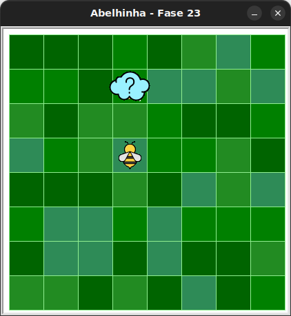

# Usando blocos if/else

No Python, além do bloco `if`, você pode usar o bloco `else` para executar um código alternativo quando a condição não for verdadeira.

Por exemplo:

```python
if maia.no_girassol():
    maia.obtenha_nectar()
else:
    maia.faça_mel()
```

Isso é útil quando você precisa tomar decisões diferentes dependendo do que Maia encontra pelo caminho!

Observe que o `else` deve estar alinhado com o `if`, além de não ser possível
usar um `else` sem um `if`, por isso o `if/else` é contado como apenas um bloco.


## 🐝 Sua vez de praticar

Nesta fase, algumas nuvens podem esconder colmeias e outras podem esconder girassóis. Use o bloco `if/else` para decidir se Maia deve colher néctar ou fazer mel.



## 🧰 Caixa de ferramentas

### Mundo (turtle)

- `import turtle`

- `turtle.mainloop()`

### Abelhinha

- `from kareto.fase23 import Abelha`

- `maia = Abelha()`

- `maia.avance()`

- `maia.direita()`

- `maia.esquerda()`

- `maia.obtenha_nectar()`

- `maia.faça_mel()`

- `maia.na_colmeia()`

- `maia.no_girassol()`

### Repetição (Python)

- `for n in range(???):`

### Condicional (Python)

- `if maia.na_colmeia():`

- `if maia.no_girassol():`

- `else:`

## 💻 Código inicial

```python
import turtle
from kareto.fase23 import Abelha

maia = Abelha()

# Seu código aqui

# Fim do seu código

turtle.mainloop()
```

[Anterior](../fase22/README.md)
