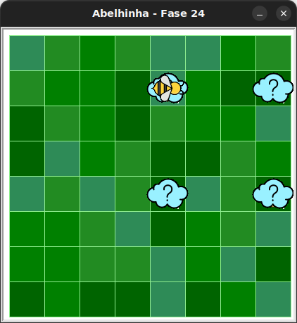

# Desafio quebra-cabeça

Desafios de quebra-cabeça são exercícios projetados para expandir seu cérebro!
Faça o melhor que você pode!

## 🐝 Sua vez de praticar

Haverá ou uma flor, ou uma colmeia abaixo dessas nuvens!

Colete o néctar uma vez se houver uma flor. Se não, faça mel uma vez
(pois existe uma colmeia).

Use no máximo 7 blocos da caixa de ferramentas.



## 🧰 Caixa de ferramentas

### Mundo (turtle)

- `import turtle`

- `turtle.mainloop()`

### Abelhinha

- `from kareto.fase24 import Abelha`

- `maia = Abelha()`

- `maia.avance()`

- `maia.direita()`

- `maia.esquerda()`

- `maia.obtenha_nectar()`

- `maia.faça_mel()`

- `maia.na_colmeia()`

- `maia.no_girassol()`

### Repetição (Python)

- `for n in range(???):`

### Condicional (Python)

- `if maia.na_colmeia():`

- `if maia.no_girassol():`

- `else:`

## 💻 Código inicial

```python

import turtle
from kareto.fase24 import Abelha

maia = Abelha()

# Seu código aqui

# Fim do seu código

turtle.mainloop()

```

[Anterior](../fase23/README.md)
