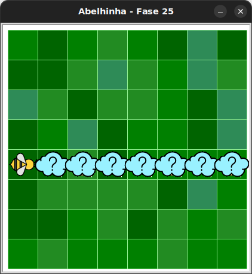

# Muitos girassóis e colmeias

As nuvens ocultam girassóis ou colmeias. 




## 🐝 Sua vez de praticar

Colete todo o néctar ou faça todo o mel. Você só pode coletar néctar de flores
e fazer mel com colmeias. Verifique todas as posições para ver se existe um
girassol ou colmeia. Só poderá haver uma flor ou uma colmeia atrás de cada nuvem.

Percorra todas as nuvens, verificando se há flor ou colmeia, e colete o néctar
ou faça mel conforme o caso.

Use no máximo 5 blocos.

## 🧰 Caixa de ferramentas

### Mundo (turtle)
- `import turtle`

- `turtle.mainloop()`

### Abelhinha
- `from kareto.fase25 import Abelha`

- `maia = Abelha()`

- `maia.avance()`

- `maia.direita()`

- `maia.esquerda()`

- `maia.obtenha_nectar()`

- `maia.faça_mel()`

- `maia.na_colmeia()`

- `maia.no_girassol()`

### Repetição (Python)
- `for n in range(???):`

### Condicional (Python)
- `if maia.na_colmeia():`

- `if maia.no_girassol():`

- `else:`

## 💻 Código inicial

```python
import turtle
from kareto.fase25 import Abelha

maia = Abelha()

# Seu código aqui

# Fim do seu código

turtle.mainloop()
```

[Anterior](../fase24/README.md) | [Próxima](../fase26/README.md)
