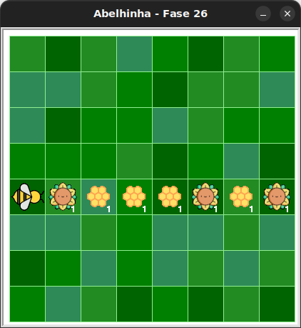

# Muitos girassóis e colmeias (sem nuvens)

Nesta fase, não há nuvens! Mas ainda há girassóis e colmeias distribuídos
em linha, como na fase anterior.

## 🐝 Sua vez de praticar

Condicionais podem ser úteis, mesmo se você souber exatamente o que há em
cada lugar!

Colete todo o nectar e faça todo o mel com no máximo 5 blocos.



## 🧰 Caixa de ferramentas

### Mundo (turtle)

- `import turtle`

- `turtle.mainloop()`

### Abelhinha

- `from kareto.fase26 import Abelha`

- `maia = Abelha()`

- `maia.avance()`

- `maia.direita()`

- `maia.esquerda()`

- `maia.obtenha_nectar()`

- `maia.faça_mel()`

- `maia.na_colmeia()`

- `maia.no_girassol()`

### Repetição (Python)
- `for n in range(???):`

### Condicional (Python)
- `if maia.na_colmeia():`

- `if maia.no_girassol():`

- `else:`

## 💻 Código inicial

```python
import turtle
from kareto.fase26 import Abelha

maia = Abelha()

# Seu código aqui

# Fim do seu código

turtle.mainloop()
```

[Anterior](../fase25/README.md) | [Próximo](../fase27/README.md)
