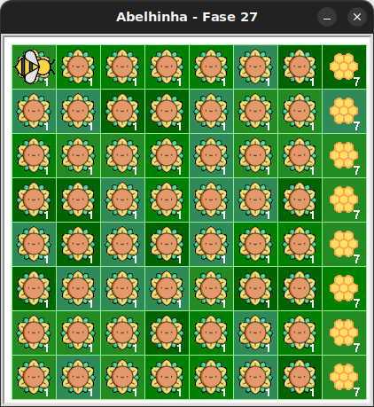

# Jardim de Néctar e Mel

Neste desafio, todas as posições do jardim possuem um girassol ou uma colmeia.

- Em cada linha, as 7 primeiras posições têm um girassol com 1 néctar.
- A última posição de cada linha tem uma colmeia com 7 néctares.
- A abelha começa na primeira linha, primeira coluna.

## 🐝 Sua vez de praticar

Colha todo o néctar dos girassóis e faça todo o mel nas colmeias!



## 🧰 Caixa de ferramentas

### Mundo (turtle)
- `import turtle`

- `turtle.mainloop()`

### Abelhinha
- `from kareto.fase27 import Abelha`

- `maia = Abelha()`

- `maia.avance()`

- `maia.direita()`

- `maia.esquerda()`

- `maia.obtenha_nectar()`

- `maia.faça_mel()`

- `maia.na_colmeia()`

- `maia.no_girassol()`

### Repetição (Python)
- `for n in range(???):`

### Condicional (Python)
- `if maia.na_colmeia():`

- `if maia.no_girassol():`

- `else:`

## 💻 Código inicial

```python
import turtle
from kareto.fase27 import Abelha

maia = Abelha()

# Seu código aqui

# Fim do seu código

turtle.mainloop()
```

[Anterior](../fase26/README.md)
