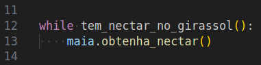
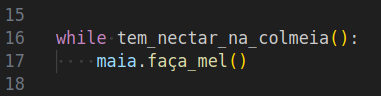
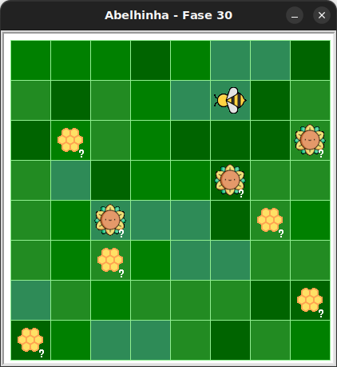

# Laços condicionais com Maia

Este é um bloco de laço condicional:



O código dentro de um bloco laço condicional (delimitado pela indentação)
é executado apenas se uma **condição** é **verdadeira**, mas depois de executado,
a condição é novamente avaliada e então o bloco dentro do laço condicional pode
novamente ser executado. Isso é repetido até que a condição seja **falsa**.

Em desafios com laços condicionais, podemos querer verificar uma condição,
como "**enquanto** há néctar no girassol" e então colher néctar.

Ou podemos verificar se há néctar na colmeia e então fazer mel:



Laços condicionais são úteis quando a quantidade de repetição
não é conhecida (como ocorre nos laços `for`).
Porém, é necessário que haja uma condição de parada e que o bloco de código
interno ao laço altere essa condição.
Caso contrário, você entrará em uma repetição infinita.

Observe que as duas novas funções nos trechos acima
(`tem_nectar_no_girassol` e `tem_nectar_na_colmeia`) são funções globais,
importadas diretamente dos módulos, não associadas a objetos específicos.


## 🐝 Sua vez de praticar

1. Crie uma pasta onde você colocará todos seus exercícios (ou use a anterior).
1. Faça o download do pacote kareto atualizado [clicando aqui](https://github.com/adorilson/kareto/releases/download/v0.3/kareto.zip).
1. Descompacte o pacote na mesma pasta criada anteriormente.
1. Abra essa pasta no VS Code.
1. Copie o código inicial deste exercício.
1. Crie um novo arquivo no VS Code e cole o código inicial nele.
1. Salve este arquivo na pasta criada.
1. Execute o arquivo e veja que agora há um sinal de interrogação (**?**) no
lugar da quantidade de néctar ou mel. 

Se tudo deu certo, você verá um jardim semelhante a este:



Você não sabe quanto néctar ou mel haverá até que o código seja executado.

## 🧰 Caixa de ferramentas

`import turtle`

`from kareto import fase30`

`turtle.mainloop()`


## 💻 Código inicial

```python
import turtle

from kareto import fase30


turtle.mainloop()

```

[Próximo](kareto/fase31/README.md)

