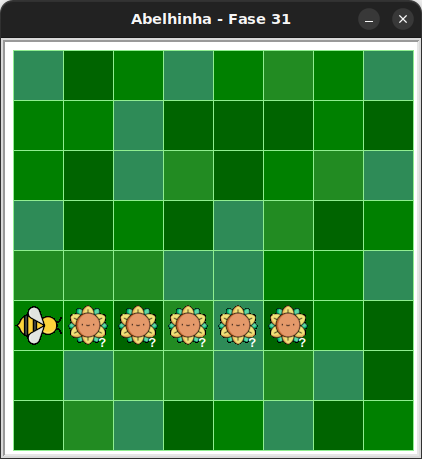

# Girassóis à frente

Nesta fase, há uma abelha e cinco girassóis logo à frente dela, mas a quantidade de néctar em cada girassol é sorteada a cada execução.

## 🐝 Sua vez de praticar

Colha todo o néctar dos girassóis!



## 🧰 Caixa de ferramentas

### Mundo (turtle)
- `import turtle`

- `turtle.mainloop()`

### Kareto
- `from kareto.fase31 import Abelha, tem_nectar_no_girassol`

- `tem_nectar_no_girassol()`

- `maia = Abelha()`

- `maia.avance()`

- `maia.obtenha_nectar()`

- `maia.no_girassol()`

### Repetição (Python)
- `while tem_nectar_no_girassol():`

- `for _ in range(5):`

## 💻 Código inicial

```python
import turtle
from kareto.fase31 import Abelha, tem_nectar_no_girassol

maia = Abelha()


# Seu código aqui


# Fim do seu código

maia.avance()

turtle.mainloop()
```

[Anterior](../fase30/README.md) | [Próximo](../fase32/README.md)
