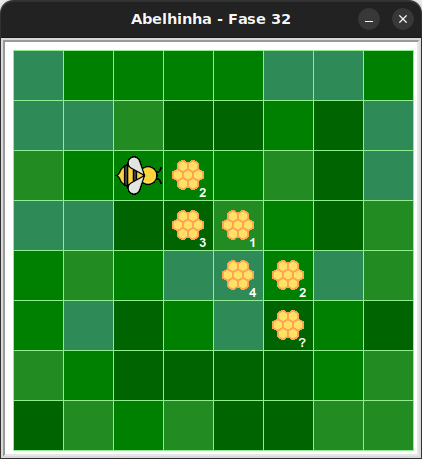

# Caminho das colmeias em L

Nesta fase, a abelha deve transformar todo o néctar de uma sequência de 6 colmeias em mel, alternando entre avançar e descer. Os 5 primeiros colmeias têm quantidades fixas de néctar, o último tem quantidade aleatória.


## 🐝 Sua vez de praticar

Transforme todo o néctar das colmeias em mel!

Observe que aqui, embora seja conhecido o número de nectares das primeiras
colmeias, não é possível usar apenas um laço de repetição `for`, pois a
quantidade é sempre diferente e sem relação.




## 🧰 Caixa de ferramentas

### Mundo (turtle)
- `import turtle`

- `turtle.mainloop()`


### Kareto

- `from kareto.fase32 import Abelha, tem_mel_na_colmeia`

- `maia = Abelha()`

- `maia.avance()`

- `maia.direita()`

- `maia.esquerda()`

- `maia.faça_mel()`

- `tem_mel_na_colmeia()`


### Repetição (Python)
- `for n in range(???):`

- `while tem_mel_na_colmeia:`


## 💻 Código inicial

```python
import turtle
from kareto.fase32 import Abelha, tem_mel_na_colmeia

maia = Abelha()

# Seu código aqui


# Fim do seu código

turtle.mainloop()
```

[Anterior](../fase31/README.md) | [Próximo](../fase33/README.md)
