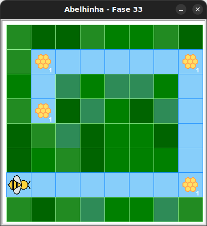

# Caminho das colmeias 2

Nesta fase, a abelha deve transformar todo o néctar de 4 colmeias em mel, seguindo o caminho azul.

Para saber se ainda há caminho à frente, use a função `tem_caminho`.

## 🐝 Sua vez de praticar

Transforme todo o néctar das colmeias em mel!
Use no máximo 5 blocos. O número entre parenteses na caixa de ferramentas
indica a quantidade máxima que você deve usar daquele bloco.



## 🧰 Caixa de ferramentas


### Mundo (turtle)

- `import turtle`

- `turtle.mainloop()`

### Kareto
- `from kareto.fase33 import Abelha, tem_caminho, tem_nectar_na_colmeia`

- `maia = Abelha()`

- `maia.avance()` (1)

- `maia.direita()`

- `maia.esquerda()`

- `maia.faça_mel()`

- `tem_nectar_na_colmeia()`

- `tem_caminho()`

### Repetição (Python)

- `for n in range(???):` (1)

- `while tem_caminho():`

## 💻 Código inicial

```python
import turtle
from kareto.fase33 import Abelha, tem_caminho, tem_nectar_na_colmeia

maia = Abelha()

# Seu código aqui


# Fim do seu código

turtle.mainloop()
```

[Anterior](../fase32/README.md) | [Próximo](../fase34/README.md)
