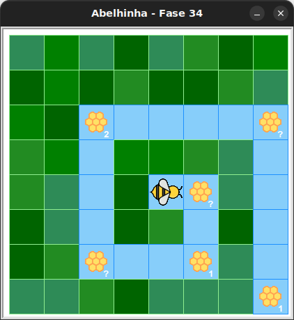

# Desafio

Mais um desafio para expandir seu cérebro e habilidades.
Faça o melhor que você pode.


## 🐝 Sua vez de praticar

Transforme todo o néctar das colmeias em mel!
Será necessário usar mais de um laço condicional `while`,
mas use no máximo 6 blocos.




## 🧰 Caixa de ferramentas

### Mundo (turtle)

- `import turtle`

- `turtle.mainloop()`

### Abelhinha

- `from kareto.fase34 import Abelha, tem_nectar_na_colmeia, tem_caminho`

- `maia = Abelha()`

- `maia.avance()`

- `maia.direita()`

- `maia.esquerda()`

- `maia.faça_mel()`

- `tem_nectar_na_colmeia()`

- `tem_caminho()`

### Repetição (Python)

- `for n in range(???):`

- `while tem_nectar_na_colmeia():`

- `while tem_caminho():`


## 💻 Código inicial

```python
import turtle
from kareto.fase34 import Abelha, tem_nectar_na_colmeia, tem_caminho

maia = Abelha()

# Seu código aqui


# Fim do seu código

turtle.mainloop()
```

[Anterior](../fase33/README.md) | [Próxima](../fase35/README.md)
