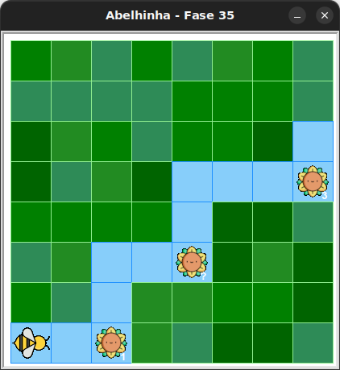

# Caminho dos girassóis

Mais néctar para ser colhido.

## 🐝 Sua vez de praticar

Colha todo o néctar dos girassóis!

Será necessário usar mais de um laço condicional `while`,
mas use no máximo 9 blocos e cuidado com as identações.



## 🧰 Caixa de ferramentas

### Mundo (turtle)

- `import turtle`

- `turtle.mainloop()`

### Abelhinha

- `from kareto.fase35 import Abelha, tem_nectar_no_girassol, tem_caminho`

- `maia = Abelha()`

- `maia.avance()`

- `maia.direita()`

- `maia.esquerda()`

- `maia.obtenha_nectar()`

- `tem_nectar_no_girassol()`

- `tem_caminho()`


### Repetição (Python)

- `for n in range(???):`

- `while tem_caminho():`

- `while tem_nectar_no_girassol():`


## 💻 Código inicial

```python
import turtle
from kareto.fase35 import Abelha, tem_nectar_no_girassol, tem_caminho

maia = Abelha()

# Seu código aqui


# Fim do seu código

turtle.mainloop()
```

[Anterior](../fase34/README.md)
