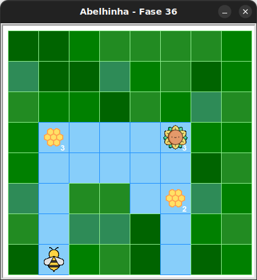

# Detetive de código: colméias e girassóis

Considerando o seguinte jardim



O que acontecerá quando o código abaixo for executado?


<!-- para a lista ser A, B, C, D -->
<style type="text/css">
    ol { list-style-type: upper-alpha; }
</style>

1) Nada. A abelha nem sairá do lugar.
1) A abelha não colherá o nectar do girassol.
1) A abelha não fará mel em todas as colmeias.
1) A abelha colherá todo o néctar e fará todo o mel.

Use o código inicial para enviar sua resposta.


## 🐝 Sua vez de praticar

Use o código inicial para enviar sua resposta.


## 🧰 Caixa de ferramentas

`resposta = "Escreva sua resposta aqui"`

`print(resposta)`


## 💻 Código inicial

```python

resposta = "Escreva sua resposta aqui"
print(resposta)

```

[Anterior](../fase35/README.md)
