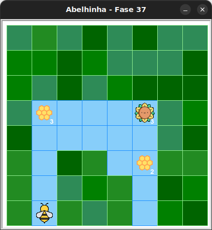

# Descobrindo o mistério

Implemente o código do exercício anterior e confira se sua previsão estava correta.


## 🐝 Sua vez de praticar

Caso a abelha não tenha colhido todo o néctar do girassol e feito
o mel em todas as colmeias, corrija o código para tal.



## 🧰 Caixa de ferramentas

### Mundo (turtle)

- `import turtle`

- `turtle.mainloop()`

### Abelhinha

- `from kareto.fase37 import Abelha, tem_nectar_no_girassol, tem_caminho`

- `maia = Abelha()`

- `maia.avance()`

- `maia.direita()`

- `maia.esquerda()`

- `maia.obtenha_nectar()`

- `tem_nectar_no_girassol()`

- `tem_caminho()`


### Repetição (Python)

- `for n in range(???):`

- `while tem_caminho():`

- `while tem_nectar_no_girassol():`

- `while tem_mel_na_colmeia():`

## 💻 Código inicial

```python

# Este é 100% com você.

```

[Anterior](../fase36/README.md)
