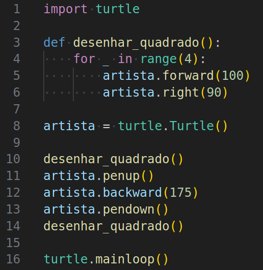

# Funções com Artista

Agora, você será apresentada ao uso de funções no Python com a Artista.

Imagens magníficas serão criadas e modificadas.
Para padrões mais complicados, você aprenderá sobre aninhamento de funções, chamando uma função dentro de outra.

Na verdade, você já usou diversas funções, de diversas origens, como:
1. a unipresente `mainloop` do módulo embutido `turtle`
2. `choice` do módulo `random`, usada no exercício 2.4
3. funções do módulo `festa_dançante` do bloco 3 de exercícios
4. as funções `on*` do módulo `turtle` para tratamento de eventos
5. as funções globais `range` (em conjunto com a instrução `for`) e `print` nos exercícios de previsão
6. e mais recentemente as funções 
`tem_nectar_no_girassol`,`tem_nectar_na_colmeia` e `tem_caminho` do pacote `kareto`


## 🐝 Sua vez de praticar

Nesta seção você vai aprender a criar suas próprias funções,
mas antes analise o código a seguir:



O que irá acontecer quando esse código é executado?

<!-- para a lista ser A, B, C, D -->
<style type="text/css">
    ol { list-style-type: upper-alpha; }
</style>

1) Nada. A função não é chamada neste programa.
1) A artista desenhará um único quadrado.
1) A artista desenhará dois quadrados que se sobrepõem.
1) A artista desenhará dois quadrados com um pequeno espaço entre eles.

Use o código inicial para enviar sua resposta.

## 🧰 Caixa de ferramentas

`resposta = "Sua resposta aqui"`

`print(resposta)`


## 💻 Código inicial

```python
resposta = "Sua resposta aqui"

print(resposta)
```

[Próximo](kareto/fase71/README.md)

