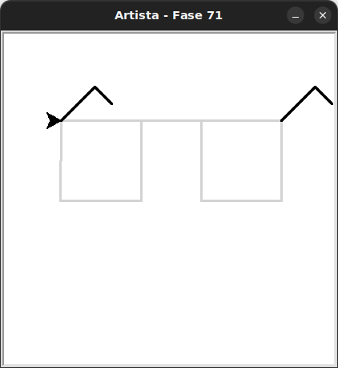

# Um ~~primeiro~~ segundo olhar em funções

Nas fases anteriores, você aprendeu a usar **laços de repetição** para repetir comandos.
Agora, vamos aprender a criar nossos próprios blocos de código, chamados **funções**. Com isso você poderá **reutilizar** comandos.

Uma função é como ensinar a tartaruga a fazer algo novo.
Por exemplo, podemos ensiná-la a desenhar um quadrado, e depois pedir para ela repetir esse desenho quantas vezes quisermos!

Veja:

```python
def desenhar_quadrado():
    for _ in range(4):
        artista.forward(100)
        artista.right(90)
```

Aqui estamos **def**inindo uma função chamada `desenhar_quadrado`.
Ela não é executada automaticamente.
Aqui você está apenas colocando um nome no espaço de nomes do Python.
Para **executar**, usamos o nome dela com o operador de chamada, os parentêses **`()`**.

```python
desenhar_quadrado()
```

Naturalmente, é também necessário criar o objeto `artista` antes da chamada.


## 🐝 Sua vez de praticar

Antes, atualize o seu pacote `kareto` baixando a nova versão [clicando aqui](https://github.com/adorilson/kareto/releases/download/v0.5/kareto.zip). 

O código inicial tem a função quadrado e uma chamada que cria uma lente desses óculos.
Você deverá usar a mesma função para criar a outra lente e completar os óculos.

Os quadrados estão separados por 75 pixels.




## 🧰 Caixa de ferramentas

### Mundo (turtle)
- `import turtle`

- `turtle.mainloop()`

- `artista.forward(???)`

- `artista.right(???)`

- `artista.left(???)`

### Kareto
- `from kareto.fase71 import Artista`

- `artista = Artista()`

### Python
- `def desenhar_quadrado():`

- `for _ in range(???):`


## 💻 Código inicial

```python
import turtle
from kareto.fase71 import Artista


# definição da função
def desenhar_quadrado():
    """Desenha um quadrado com lado de 100 pixels."""
    for _ in range(4):
        artista.forward(100)
        artista.right(90)

artista = Artista()

# chamada/execução da função
desenhar_quadrado()


turtle.mainloop()
```

[Anterior](../../README.md) | [Próximo](../fase72/README.md)
