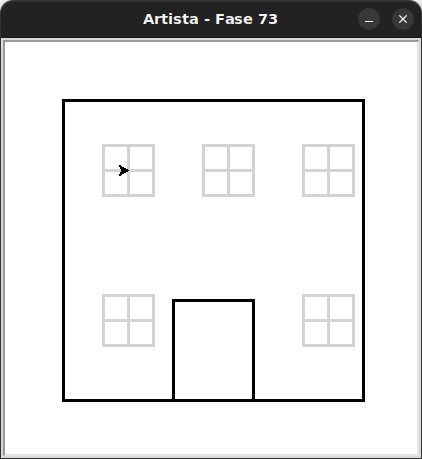

# Uma casa com muitas janelas

Desenhar todas as 5 janelas de uma casa individualmente seria uma dor!
Mas com uma função isso fica muito mais fácil.

## 🐝 Sua vez de praticar

Faça artista desenhar as 5 janelas da casa.
Você deverá implementar a função e depois suas chamadas,
não esqueça de posicionar a artista nas posições corretas.




- Cada janela é composta de quatro quadrados de `25` pixels.
- As janelas superiores estão a um salto de `100` pixels uma da outra.
- As janelas inferiores estão a um salto de `150` pixels abaixo do conjunto superior.

Relembre, na `Caixa de ferramentas`, ou conheça novos métodos da artista que
podem ser úteis para posicioná-la no local de cada janela. Você pode somar ou
substrair as coordenadas da artista para determinar a posição da próxima janela.
As possibilidades para resolver esse desafio são muitas.

## 🧰 Caixa de ferramentas

### Mundo (turtle)
- `import turtle`

- `turtle.mainloop()`

- `artista.forward(???)`

- `artista.right(???)`

- `artista.left(???)`

- `artista.teleport(???, ???)` # teletransporta a artista até a posição informada como parâmetro

- `artista.goto(???, ???)` # movimenta a artista até a posição informada como parâmetro

- `artista.xcor()` # retorna a coordenada x da artista

- `artista.ycor()` # retorna a coordenada y da artista

- `artista.penup()`

- `artista.pendown()`

### Kareto
- `from kareto.fase72 import Artista`

- `artista = Artista()`

- `artista.pule_para_frente(???)` 

### Python
- `def desenhe_estrela():`

- `for _ in range(???):`

- `pass`


## 💻 Código inicial

```python
import turtle
from kareto.fase73 import Artista


# definição da função
def desenhe_janela():
    pass


artista = Artista()


turtle.mainloop()
```

[Anterior](../fase72/README.md) | [Próximo](../fase72/README.md)
