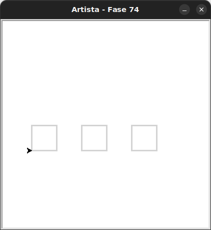

# Uma fila de quadrados

Uma função pode chamar outra função.
Basta chamá-la dentro da função externa como qualquer outra instrução.

```python
def função_unitária():
    pass

def função_composta():
    <instruções>
    função_unitária()
    <instruções> 
```

## 🐝 Sua vez de praticar

Você deverá fazer uma fila de quadrados.
Chame a função `desenha_quadrado` de dentro da sua função `desenha_uma_linha_de_quadrados`
para tornar isso ainda mais fácil.




- Os quadrados estão separados por 50 pixels.


## 🧰 Caixa de ferramentas

### Mundo (turtle)
- `import turtle`

- `turtle.mainloop()`

- `artista.forward(???)`

- `artista.right(???)`

- `artista.left(???)`

- `artista.teleport(???, ???)` # teletransporta a artista até a posição informada como parâmetro

- `artista.goto(???, ???)` # movimenta a artista até a posição informada como parâmetro

- `artista.xcor()` # retorna a coordenada x da artista

- `artista.ycor()` # retorna a coordenada y da artista

- `artista.penup()`

- `artista.pendown()`

### Kareto
- `from kareto.fase74 import Artista`

- `artista = Artista()`

- `artista.pule_para_frente(???)` 

### Python
- `def desenha_quadrado():`

- `def desenha_uma_linha_de_quadrados():`

- `desenha_quadrado()`

- `desenha_uma_linha_de_quadrados()`

- `for _ in range(???):`

- `pass`


## 💻 Código inicial

```python
import turtle
from kareto.fase74 import Artista


# definição da função
def desenhe_quadrado():
    for _ in range(4):
        artista.forward(50)
        artista.left(90)


def desenha_uma_linha_de_quadrados():
    pass


artista = Artista()
desenha_uma_linha_de_quadrados()


turtle.mainloop()
```

[Anterior](../fase73/README.md) | [Próximo](../fase74/README.md)
