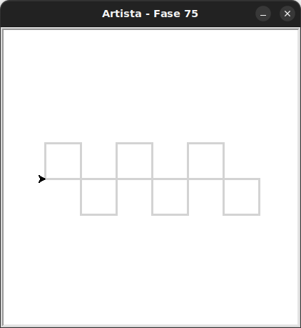

# Duas filas de quadrados

Vamos evoluir o exercício anterior para desenhar duas filas de quadrados.

## 🐝 Sua vez de praticar

A partir do exercício anterior, adicione mais uma função que cria esta pilha
de quadrados.

O padrão deverá ser criado com a chamada apenas dessa nova função.



O código inicial recupera o que você fez no última exercício, então você deverá mudar a importação para que seja
carregada a `fase75` no lugar da `fase74`.

## 🧰 Caixa de ferramentas

### Mundo (turtle)
- `import turtle`

- `turtle.mainloop()`

- `artista.forward(???)`

- `artista.right(???)`

- `artista.left(???)`

- `artista.teleport(???, ???)` # teletransporta a artista até a posição informada como parâmetro

- `artista.goto(???, ???)` # movimenta a artista até a posição informada como parâmetro

- `artista.xcor()` # retorna a coordenada x da artista

- `artista.ycor()` # retorna a coordenada y da artista

- `artista.penup()`

- `artista.pendown()`

### Kareto
- `from kareto.fase75 import Artista`

- `artista = Artista()`

- `artista.pule_para_frente(???)` 

### Python
- `def desenha_quadrado():`

- `def desenha_uma_linha_de_quadrados():`

- `def ...():`

- `desenha_quadrado()`

- `desenha_uma_linha_de_quadrados()`

- `for _ in range(???):`


- `pass`


## 💻 Código inicial

```python

# A partir do exercício anterior.
# A pessoa também deverá mudar a importação de fase74 por fase75

```

[Anterior](../fase74/README.md) | [Próximo](../fase75/README.md)
