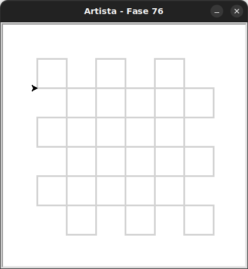

# Uma grade de quadrados

Agora use tudo o que você aprendeu para fazer uma grade de quadrados.

## 🐝 Sua vez de praticar

Reproduza esse padrão de forma modular. Ou seja, divida o trabalho em funções menores.
Faça a importação de `Artista` do módulo `kareto.fase76`.




## 🧰 Caixa de ferramentas

### Mundo (turtle)
- `import turtle`

- `turtle.mainloop()`

- `artista.forward(???)`

- `artista.right(???)`

- `artista.left(???)`

- `artista.teleport(???, ???)` # teletransporta a artista até a posição informada como parâmetro

- `artista.goto(???, ???)` # movimenta a artista até a posição informada como parâmetro

- `artista.xcor()` # retorna a coordenada x da artista

- `artista.ycor()` # retorna a coordenada y da artista

- `artista.penup()`

- `artista.pendown()`

### Kareto
- `from kareto.fase76 import Artista`

- `artista = Artista()`

- `artista.pule_para_frente(???)`

### Python

- `def ...():`

- `for _ in range(???):`

- `pass`


## 💻 Código inicial

```python

# Este é todo com você.

```

[Anterior](../fase75/README.md) | [Próximo](../fase77/README.md)
