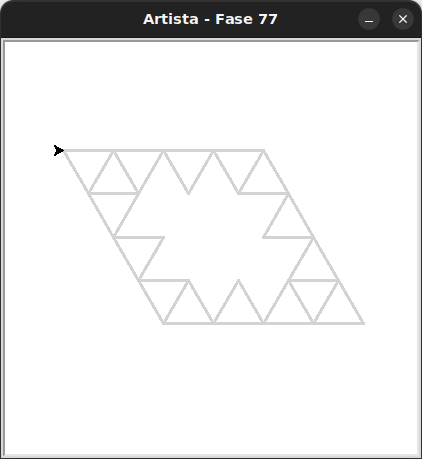

# Desafio

Vamos a um desafio.

## 🐝 Sua vez de praticar

Crie esta imagem usando os blocos fornecidos na caixa de ferramentas.

Faça a importação de `Artista` do módulo `kareto.fase77`.



- Cada triângulo tem lados de **50** pixels.
- Para desenhar um diamante, você precisará alternar entre girar **60** graus e **120** graus.

## 🧰 Caixa de ferramentas

### Mundo (turtle)
- `import turtle`

- `turtle.mainloop()`

- `artista.forward(???)`

- `artista.right(???)`

- `artista.left(???)`

### Kareto
- `from kareto.fase77 import Artista`

- `artista = Artista()`

- `artista.pule_para_frente(???)`

### Python

- `def ...():`

- `for _ in range(???):`


## 💻 Código inicial

```python

# A partir do exercício anterior.
# A pessoa também deverá mudar a importação de fase74 por fase75

```

[Anterior](../fase76/README.md) | [Próximo](../fase76/README.md)
