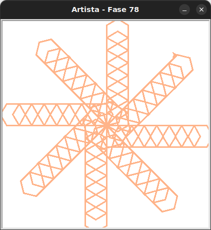

# Atividade livre

Use o que você aprendeu para fazer o que quiser!

## 🐝 Sua vez de praticar

Você pode fazer algo como esse cata-vento?



Faça a importação de `Artista` do módulo `kareto.fase78`.

O código inicial já contém funções que podem lhe ajudar nessa e em outras artes.

Ou você pode recriar/evoluir a arte que fez no playground da atividade 1.2 usando
os novos blocos.

## 🧰 Caixa de ferramentas

### Mundo (turtle)
- `import turtle`

- `turtle.mainloop()`

#### Movimentos e direção
- `artista.forward(???)`

- `artista.right(???)`

- `artista.left(???)`

- `artista.goto(???, ???)`

- `artista.teleport(???, ???)`

- `artista.setheading(???)`

- `artista.shapesize(???)`

- `artista.pensize(???)`

- `artista.stamp()`

#### Aparência

- `artista.color(???)`

- `artista.shape(???)`

- `artista.hideturtle()`

- `artista.showturtle()`


### Kareto
- `from kareto.fase78 import Artista`

- `artista = Artista()`

- `artista.pule_para_frente(???)`

- `artista.mude_cor()` # define uma cor aleatória


### Python

- `def ...():`

- `for _ in range(???):`


## 💻 Código inicial

```python
import turtle
from kareto.fase78 import Artista

def hexagono():
    for _ in range(6):
        artista.forward(25)
        artista.right(60)

def linha_de_hexagonos():
    for _ in range(8):
        hexagono()
        artista.pule_para_frente(25)

def quadrado():
    for _ in range(4):
        artista.forward(50)
        artista.left(90)

def linha_de_quadrados():
    for _ in range(3):
        quadrado()
        artista.pule_para_frente(100)

def quadrado_deslocados():
    for _ in range(2):
        linha_de_hexagonos()
        artista.right(180)

artista = Artista()


turtle.mainloop()

```

[Anterior](../fase77/README.md)
